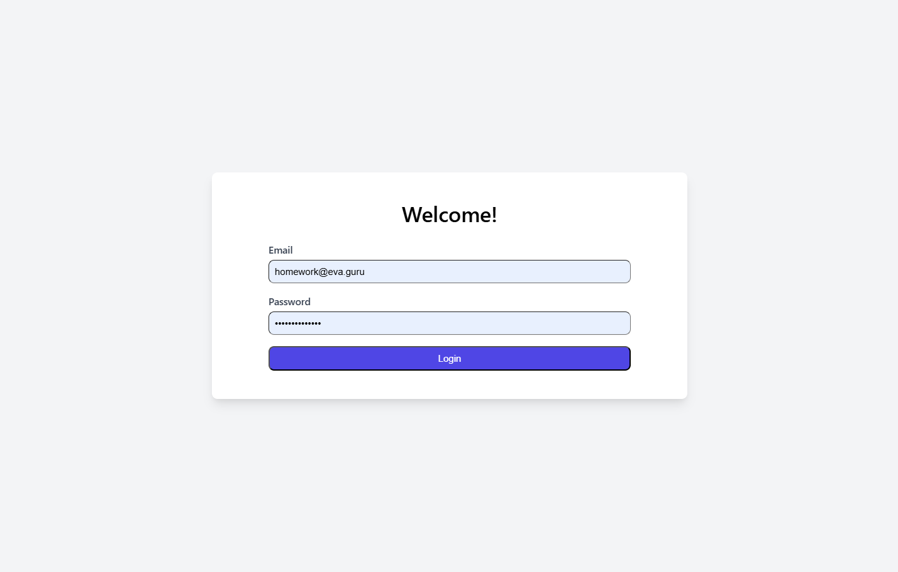
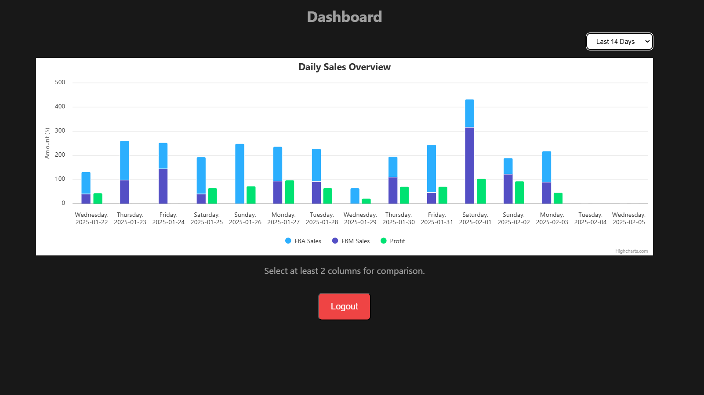
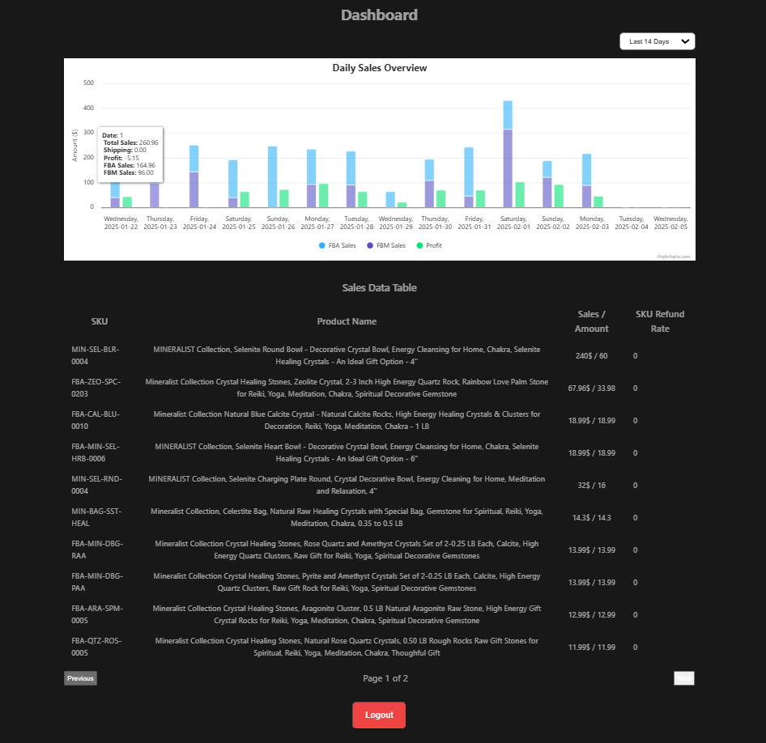

# Eva Guru Frontend Developer Candidate Task

This template should help get you started developing with Vue 3 in Vite.

## Screenshots

### Login page | (/) Route



### Default Dashboard Page | (/dashboard) Route



### Dashboard Page With Data Table | (/dashboard) Route



## Package File

```
{
  "name": "frontend-task",
  "version": "0.0.0",
  "private": true,
  "type": "module",
  "scripts": {
    "dev": "vite",
    "build": "run-p type-check \"build-only {@}\" --",
    "preview": "vite preview",
    "build-only": "vite build",
    "type-check": "vue-tsc --build",
    "lint": "eslint . --fix",
    "format": "prettier --write src/"
  },
  "dependencies": {
    "axios": "^1.7.9",
    "highcharts": "^12.1.2",
    "init": "^0.1.2",
    "pinia": "^2.3.1",
    "vue": "^3.5.13",
    "vue-router": "^4.5.0",
    "vue3-highcharts": "^0.1.3"
  },
  "devDependencies": {
    "@tailwindcss/postcss7-compat": "^2.2.17",
    "@tsconfig/node22": "^22.0.0",
    "@types/highcharts": "^5.0.44",
    "@types/node": "^22.10.7",
    "@vitejs/plugin-vue": "^5.2.1",
    "@vitejs/plugin-vue-jsx": "^4.1.1",
    "@vue/eslint-config-prettier": "^10.1.0",
    "@vue/eslint-config-typescript": "^14.3.0",
    "@vue/tsconfig": "^0.7.0",
    "autoprefixer": "^10.4.20",
    "eslint": "^9.18.0",
    "eslint-plugin-vue": "^9.32.0",
    "jiti": "^2.4.2",
    "npm-run-all2": "^7.0.2",
    "postcss": "^8.5.1",
    "prettier": "^3.4.2",
    "tailwindcss": "^3.4.17",
    "typescript": "~5.7.3",
    "vite": "^6.0.11",
    "vite-plugin-vue-devtools": "^7.7.0",
    "vue-tsc": "^2.2.0"
  }
}
```

## Recommended IDE Setup

[VSCode](https://code.visualstudio.com/) + [Volar](https://marketplace.visualstudio.com/items?itemName=Vue.volar) (and disable Vetur).

## Type Support for `.vue` Imports in TS

TypeScript cannot handle type information for `.vue` imports by default, so we replace the `tsc` CLI with `vue-tsc` for type checking. In editors, we need [Volar](https://marketplace.visualstudio.com/items?itemName=Vue.volar) to make the TypeScript language service aware of `.vue` types.

## Customize configuration

See [Vite Configuration Reference](https://vite.dev/config/).

## Project Setup

```sh
npm install
```

### Compile and Hot-Reload for Development

```sh
npm run dev
```

### Type-Check, Compile and Minify for Production

```sh
npm run build
```

### Lint with [ESLint](https://eslint.org/)

```sh
npm run lint
```
